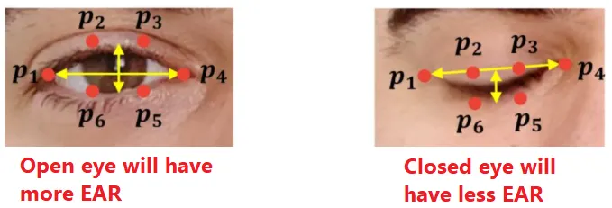

#  Eye + Posture Annotator API

A simple **AI-powered video annotation service** that automatically analyzes a video (captured from a laptop webcam or similar source) and provides **frame-by-frame labels** of:
-  **Eye State** — whether the person’s eyes are **Open** or **Closed**
-  **Posture** — whether the person’s posture is **Straight** or **Hunched**

This service exposes a single REST API endpoint (`POST /annotate`) which accepts a video file (`.mp4 or .avi`) and returns the corresponding annotations in structured JSON format.

---

##  Overview

###  Goal
To build an **automated annotation API** that processes pre-recorded videos and returns frame-wise analysis of:
- **Eye State:** Open or Closed  
- **Posture:** Straight or Hunched  

The pipeline handles:
1. **Video ingestion**
2. **Face & pose detection using MediaPipe**
3. **Eye Aspect Ratio (EAR)**–based blink detection  
4. **Shoulder–Nose geometry**–based posture assessment  
5. **Annotated JSON generation** and optional video rendering  

---

##  System Flow

```text
FastAPI (backend server)
│
├── /annotate (POST)
│     ├── Accepts: .mp4 or .avi video
│     ├── Runs processing pipeline:
│     │     ├── controller/eye_state.py      → Eye blink detection
│     │     ├── controller/posture_state.py  → Posture detection
│     │     ├── process.py                   → Full per-frame orchestration
│     │
│     ├── Returns: JSON with frame-wise labels
│     └── (Optional(not tested)) Compares against ground truth for F1 scores
│
└── main.py → Application entrypoint entrypoint

```
---

##  Approach and AI Model Choice


###  Eye State Detection

Eye state is determined using **MediaPipe FaceMesh** landmarks and the **Eye Aspect Ratio (EAR)** technique — a geometry-based measure of eyelid openness.

####  Formula




where:

* ( p_1, p_2, p_3, p_4, p_5, p_6 ) are landmark coordinates (from MediaPipe) around the eye contour.

  * **Left Eye Landmarks:** `[33, 160, 158, 133, 153, 144]`
  * **Right Eye Landmarks:** `[362, 385, 387, 263, 373, 380]`
* ( ‖a - b‖ ) is the Euclidean distance between two points.

The **average EAR** across both eyes is used as the final measure per frame:


EAR_avg = (EAR_left + EAR_right)/2


####  Technique

The blink and eye-open logic combines **two complementary approaches**:

1. **Hysteresis Thresholding** — prevents flickering by defining two dynamic thresholds based on the median open-eye EAR:

   * **Close Threshold:** `CLOSE_THRESH_RATIO × open_median`
   * **Open Threshold:** `OPEN_THRESH_RATIO × open_median`
   * Typical values: 0.65 (close), 0.75 (open)
   * Eye only toggles from *open → closed* when below the close threshold and *closed → open* when above the open threshold.

2. **Time Debouncing (Temporal Consistency)** — ensures blinks are only registered after consecutive frames below/above the threshold:

   * `CLOSE_TIME_SEC` ≈ 0.07 sec
   * `OPEN_TIME_SEC` ≈ 0.10 sec
   * Prevents false positives due to transient eye movements.

3. **Combined Mode (Default)**
   The system fuses **Hysteresis + Time Mode**, making it robust under variable lighting or head movement:

   * Eyes are marked *closed* only if both threshold and timing conditions are satisfied.
   * Each time the eyes reopen, the blink counter increments.

####  Classification Logic

* **Open** → if `EAR > open_threshold`
* **Closed** → if `EAR < close_threshold` and sustained for required frames
* **Blink Detection** → triggered on transition `Closed → Open`

####  Advantages

* Works reliably under different lighting conditions.
* Resilient against noise and small head rotations.
* No ML model training required — purely geometry-based.
* Real-time performance with minimal CPU load.

---


### Posture Detection and Classification

Posture is determined using **MediaPipe FaceMesh** and **Pose** landmarks, classifying frames as **Straight** or **Hunched** based on vertical alignment and scale-normalized distances.

#### Landmarks Used

* **FaceMesh:** Forehead (10), Nose Tip (1), Chin (152), Left Eye Outer (33), Right Eye Outer (263)
* **Pose:** Left Shoulder (11), Right Shoulder (12)

#### Calibration

During an initial calibration (~60 frames), the system records reference values:

```
face_ref = median(chin_y − forehead_y)
shoulder_ref = median(left_shoulder_x − right_shoulder_x)
```

These serve as the baseline for upright posture. If shoulders are missing, inter-eye width estimates distance to the camera.

#### Frame-wise Posture Evaluation

1. Compute current measurements:

```
face_h = |chin_y − forehead_y|
sh_w = |left_shoulder_x − right_shoulder_x|
```

2. Compute scale-adjusted ratio:

```
scale_ratio = (FACE_WEIGHT*face_ref + SHOULDER_WEIGHT*shoulder_ref) /
              (FACE_WEIGHT*face_h + SHOULDER_WEIGHT*sh_w)
```

3. Calculate vertical displacement:

```
ratio = ((nose_y − mid_shoulder_y) / face_h) * scale_ratio
shifted = ratio − GOOD_CENTER_REL
```

4. Convert to posture score:

```
raw_score = SCALE_FACTOR * exp(−SENSITIVITY * shifted)
raw_score = clip(raw_score, 0, SCALE_FACTOR)
smooth_score = EMA_ALPHA * raw_score + (1 − EMA_ALPHA) * prev_smooth_score
```

#### Classification

* `smooth_score >= 1.30` → **Straight**
* Otherwise → **Hunched**

This approach provides scale-invariant, smooth, and reliable posture classification.

*This score was calculated based on calibration of a posture being good or bad using my own laptop webcam footage. Hence it may not give out accurate posture labels which may intuitively differ from the actual posture of a person which depends on their physical attributes and camera setup. Hence please infer these labels as a general classification of a person's posture using their webcam footage and not an actual scientific classification of their posture (which requires additional data and improved classification metric)*

---


###  Libraries Used

* **MediaPipe** — Landmark extraction (face and body)
* **OpenCV** — Frame capture, video writing, drawing annotations
* **NumPy** — Vector math, smoothing, and signal processing
* **FastAPI** — REST API backend
* **Uvicorn** — Development server
* **Scikit-Learn** — F1 Score evaluation

---
##  Installation & Setup

### Python Verison

The python version used in this project is `3.10.19` installed via a miniconda virtual environment

###  Clone the repository

```bash
git clone https://github.com/AkshayB353/Auto_Eye_Posture_Annotation_API.git

cd Auto_Eye_Posture_Annotation_API
```

###  Create and activate a virtual environment

1. Using Python Virtual Environment Library

```bash
python -m venv venv
source venv/bin/activate        # Mac/Linux
venv\Scripts\activate           # Windows
```
2. Using Anaconda/Miniconda

```bash
conda create -n myenv python=3.10.19

conda activate myevn

conda env list
```

###  Install dependencies

```bash
pip install -r requirements.txt
```

*(If there is any conflict within the specific versions of the libraries mentioned in `requirements.txt`, here’s what you’ll need)*:

```bash
pip install "fastapi[standard]" uvicorn mediapipe opencv-python numpy scikit-learn
```
*These libraries will more or less install all the other necessary components with themselves.*

---

##  Running the Service

#### *If you are on a laptop system which has thrid-party performance profiles, please make sure that you set the highest performance profile before starting the server to ensure minimum latency and more accurate result due to more resources being availabe* #### 

Start the FastAPI server:

```bash
uvicorn main:app --reload --host 0.0.0.0 --port 8000
```
OR

```bash
uvicorn main:app --reload
```

By Default, the Server will run on this URL: 
 **[http://127.0.0.1:8000](http://127.0.0.1:8000)**

You can test the API using **curl**, **Postman**, or your browser using [swagger UI](http://127.0.0.1:8000/docs) for default uvicorn startup.

---

##  API Usage

### Endpoint

```
POST /annotate
```


### Request Parameters

| Parameter    | Type               | Required   | Description                           |
| ------------ | ------------------ | ---------- | ------------------------------------- |
| `video_file` | file (.mp4 / .avi) | ✅ Yes      | Input video to annotate               |
| `grnd_truth` | file (.json)       | ❌ Optional | Ground truth labels for F1 evaluation |

---

### Example `curl` Command

```bash
curl -X 'POST' \
  'http://127.0.0.1:8000/annotate' \
  -H 'accept: application/json' \
  -H 'Content-Type: multipart/form-data' \
  -F 'video_file=@sample.mp4;type=video/mp4' \
  -F 'grnd_truth=@sample.json;type=application/json'
```

### Example Response

```json
{
  "video_name": "sample_video.mp4",
  "total_frames": 240,
  "labels_per_frame": {
    "0": {"eye_state": "Open", "posture": "Straight"},
    "1": {"eye_state": "Closed", "posture": "Hunched"}
  },
}
```

---

## Evaluation Metrics (F1-Scores)
#### *This functionality has not been fully tested* ####

If you supply a **ground truth JSON** alongside the video, the system computes:

| Metric         | Description                             |
| -------------- | --------------------------------------- |
| **eye_f1**     | F1-Score for Eye State (Open/Closed)    |
| **posture_f1** | F1-Score for Posture (Straight/Hunched) |

F1 scores are computed via `controller/evaluation.py` comparing predicted vs. ground truth labels per frame.

---

##  Cost Estimation

**Estimated Runtime:** ~1.5 second per second of video with 1980x1080p resolution at 30 fps (depends on resolution. Current approach resizes any image to 640X380 resolutiaon).

**Hardware(Testing and Development):** CPU\RAM (Intel i7 12th Gen / 16GB RAM).

---

##  Example Ground Truth Format

```json
{
  "labels_per_frame": {
    "0": {"eye_state": "Open", "posture": "Straight"},
    "1": {"eye_state": "Closed", "posture": "Hunched"}
  }
}
```

---

##  Repository Structure

```
📁 controller/
│   ├── eye_state.py          # Eye aspect ratio + blink detection logic
│   ├── posture_state.py      # Shoulder alignment + posture evaluation
│
├── process.py                # End-to-end video processing pipeline
├── routes/
│   └── annotate_route.py     # FastAPI route for /annotate endpoint
├── main.py                   # Application entrypoint
└── README.md
```

---


##  Example Development Workflow

1. Start server:

   ```bash
   uvicorn main:app --reload
   ```
2. Test via `curl` or Postman.
3. (Optional) Add `grnd_truth` JSON to compute F1 scores.
4. Check output file (`output_labels.json`) or annotated video in `temp/`.

---

##  Notes and Some Limitations

* This implementation assumes a single visible person.
* Works best with stable, well-lit webcam videos.
* No GPU required — optimized for CPU inference. This may cause performance issues on laptops or system with older CPUs of previous generation and limited ram
* Currently the posture labelling threshold is heavily biased towards my own physical measurements and camera setup.
* Work remains on integrating GPU support for systems which have a dedicated GPU which can accelerate a lot of the internal calculations and speed up model inference.


### Author

 GitHub: [AkshayB353](https://github.com/AkshayB353)


